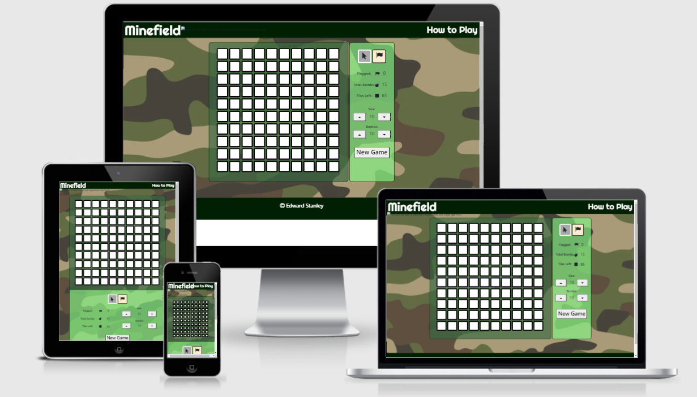
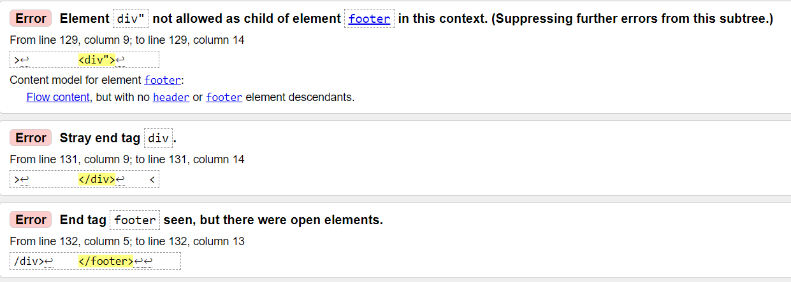
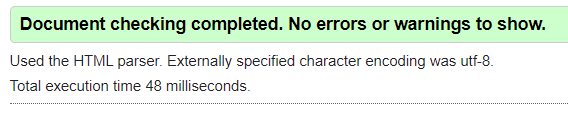
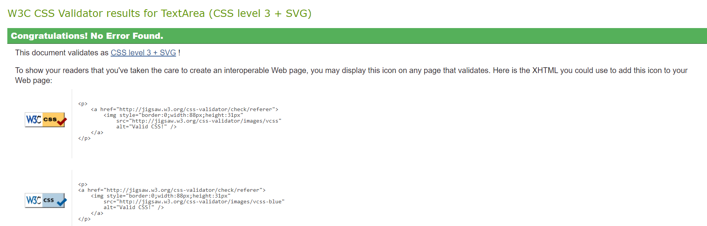
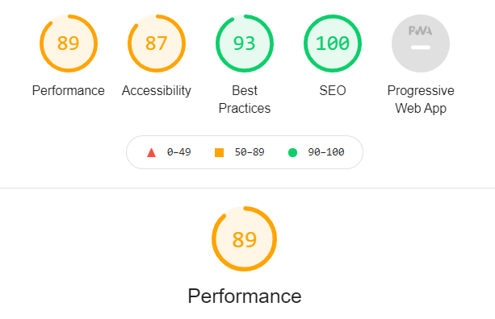

# MineField
## An Interactive Frontend Development Project by Edward Stanley
Minefield is a website that hosts the classic game MineSweeper. MineSweeper is a logic/puzzle game origionating from the 1960's in which the player must deduce the location of bombs hidden around a grid. On click, the tile reveals whether or not it is a bomb. If it is a bomb the player loses the game, if not the tile will give a value of how many bombs it is adjacent to. The other main mechanic is the process of 'flagging' tiles where a bomb is suspected to avoid revealing it. For my version of the classic, I wanted my website to allow the user to control the board size, the number of bombs, and add in some other quality of life features.
#
## PLEASE NOTE:
### Due to issues with file roots and GitHub Pages deploying, my series of commits for this project is under a different repository "SpudStar/milestone-two-commits".
Alternatively here is a link:    
https://github.com/SpudStar/milestone-two-commits
### Apologies for any inconvinience

## UX
## Different User objectives
### Site Owner's objectives
* The owner wants to make a game to be enjoyed by site visitors
* The owner wants to make a game they themselves can enjoy
* The owner wants to add as much functionality to the game as possible to make it engaging
* The owner wants to make the game's algorithm efficient to allow quick loading times.
* The owner wants users to revisit the site

### User objectives
* The user wants to be able to enjoy a full game of Minesweeper
* The user wants to be able to play on their device size without issue
* The user wants as much control over the difficulty as possible
* The user wants consistent feedback from the game to aid in logical descision making
* The user wants elements to visibly change on click to show they have interacted with it

## User Stories
### As an owner:
* I want the site to have controls for multiple devices (mouse and touchscreen controls).
* I want the user to have as much control over their experience as possible
* I want to create a game that visitors can enjoy

### As a user:
* I want to be able to play the game on any device
* I want the game to have quality of life features that handle any unecessary actions
* I want to be able to control as much of the games setup as possible
* I want to have graphics relevant to the game that clearly convey what is happening
* I want to have access to instructions on how to play

#
## Wireframes
The following wirefrane was made in Balsamiq  
[Please Click Here.](readmeassets/milestonetwowireframe.pdf)

The wireframe can also be found in the readmeassets folder included in this project

#
## Features
### Existing Features
1) The Header - Contains a logo for the website, a combination of text and icon. It also contains an external link that takes the user to a page where they can learn how to play minesweeper.
2) The Status Area - Contains a number of features such as:     
    a) Toggleable Flag and Reveal buttons for mobile users. If the user taps the flag icon, when a tile is clicked it gets flagged instead of revealed. The user can then tap the pointer icon to go back to reveal on tap. There is also a graphical update of the buttons to show the user which mose they are currently on. This also doesn't intervene with computer users being able to right click to flag.   
    b) Feedback of non-interactable logic elements to the user. There are a total of three important variables that the user is constantly updated on throughout their game. First is the number of bombs on the board, second is how many tiles the player has flagged, and third is how many more tiles need to be revealed. These are important in the descision making processes of the game hence the quick feedback is beneficial.    
    c) Variables that can be changed by the user. The user has access to two numerical inputs that control the difficulty of the game. The first is the dimensions of the board, the second is the amount of bombs. This is fed into the algorithm whenever the user creates a new board which allows user interactivity.   
    d) A button that generates a new board. The button when clicked starts the javascript algorithm to clear the old board and create a new one taking all user inputs into account.
3) The Game Itself - The game aside from running flawlessly also has a number of quality of life improvements such as:  
    a) Dynamic scaling of the tiles/game board depending on the user's window size. The algorithm reads the game areas width and calculates how big each tile should be to fit the dimension amount per row as set by the user. It also updates the size of the tiles whenever the window is resized stopping the board from warping with view width changes.   
    b) Automatic revealing of adjacent tiles if a tile with no adjacent bombs is clicked on. Occasionally a tile wont be next to a bomb, therefore to save the user a maximum of 8 extra clicks (due to cardinal directions), it automatically reveals the adjacent tiles too. In a scenario where a chain of tiles that are not adjacent to any bombs is clicked on, ALL tiles in the chain will be revealed.  
    c) Handling of user inputs and outputs. While mentioned in the Status Area features, the algorithm does more with these values. If the user enters data that is outside feasible bounds the code automatically corrects the input to the minimum/maximum available value.   
    d) Lots of carefully placed logic to avoid the user clicking on an already revealed tile, revealing a flagged tile, ect.    
    e) An alert is sent to the user depending on whether they have won or lost the game.

### Features Left to Implement
1) Audio cues when tiles are clicked or a bomb explodes to add further depth to the game.
2) A better way to notify the user whether they have won or not.
3) Possibly game modifiers such as bombs that count as being adjacent to two bombs to add more complex logic?

#
## Technologies Used
- HTML5 - Allows the website to be structured
- CSS - Allows styalising of elements to provide visual effect
- Javascript - Allows feedback from user mouse/numerical inputs and translates them into the algorithm that runs the game
- [Bootstrap](https://getbootstrap.com/) - Allowed for better structure of the Status Area elements.
- [FontAwesome](https://fontawesome.com/) - Allowed for icons to be used on tile reveal for bombs/flags
- [Google Fonts](https://fonts.google.com/) - Allowed for better styalising of the title
- [Gitpod](https://www.gitpod.io/) - The main coding platform used to create the project
- [Github](https://github.com/) - Allowed for the website to be deployed and version control
- [Gimp Studio](https://www.gimp.org/) - Allowed the editing of images for the project
#
## Testing
### HTML W3 Validator
 

 In order to check my HTML I put my website's URL into the validator. Whilst the majority was just issues with commenting which didn't affect the code, there was an odd interaction popping up between my last div in my footer. Upon further inspection I simply added a " in my div tags by mistake. Deleting it solved those errors.

 
 ### CSS W3 Validator
 
 There was no problems with my CSS code, the validator passed it first time.
 ### JSHint Validator
 After putting the code through the validator there were multiple complaints about the 'let' initialiser however on closer inspection it was fine. The most that was wrong with the code was the occasional missing semi-colon which I fixed.
### Lighthouse Testing

After running it through Google Chrome's lighthouse tool I had an overall result of 89 which was quite ideal. The page was able to load efficiently and effectively. 

### Larger issues through Testing
There were a few main problems I had with certain sections during the code which I would like to highlight. 
#### Issues with deployment
As mentioned briefly, I had an awful time trying to deploy this project initially due to the gitpod push not saving filed in github's root directory. Hence when deployed all that would load was the README. After scouring through the internet I found out that because I initially saved the HTML project as minefield.html the repository had a meltdown. Even after changing it to index.html it wouldn't allow me to deploy.

To fix this I ended up creating a new repository and transferring my code across which ended up working.
The initial repository with my commits can be found here:
https://github.com/SpudStar/milestone-two-commits  

#### Issues with revealing adjacent tiles
As mentioned in the features segment, I added some functionality to the code that allowed tiles with no adjacent bombs to reveal the tiles around them. This by far was the hardest part of the algorithm. In the code I used a variable i to iterate through every tile, and a variable j to start at the top left of the tile i and work its way along to the bottom left. The issue was on the left/right edges checking East and West overlapped into the next row which caused incorrect results.

In order to fix this I ended up using remainder calculations with the dimensions inputted by the user to check if a tile was on the far left (remainder 0) or right (remainder dimension-1) and had a function called to validate it each time.

### User Story Testing
##### *" Owner - I want the site to have controls for multiple devices (mouse and touchscreen controls). -"*
- There are optional buttons for mobile users allowing them to reveal/flag tiles as necessary. There are also alternate controls for mouse users in the form of right and left click readers to add ease of access.

##### *" User- I want to be able to play the game on any device"*
- The tiles are able to dynamically grow/shrink to fit any screen size allowing for a wide range of screen sizes to be used.

##### *" Owner - * I want the user to have as much control over their experience as possible"*
##### *" User- I want to be able to control as much of the games setup as possible"*
- The user is able to control their own diffculty through the Status Area dimension and bomb values. Their diffculty setting is essentially custom. The added functionality of the flagging also gives the user more control over the game.

##### *" User- I want the game to have quality of life features that handle any unecessary actions"*
- The game has a number of these in place. For example the auto reveal of tiles adjacent to a tile with no bombs near it speeds up the process for the user significantly especially with larger board sizes. The game also keeps track of key statistics for the user such as how many spaces they've flagged and how many tiles are left so the user doesn't have to calculate manually.

##### *" User - I want to have access to instructions on how to play"*
- The header features an external link to a page with instructions on how Minesweeper plays out.

##### *" User- I want to have graphics relevant to the game that clearly convey what is happening"*
- The use of coloured tiles in addition to the numbers on each tile creates an easier visual distinction for the user when playing the game. All colours are very different from eachother so confusion is minimum. The background graphic also doesn't distract from the game itself and the translucent overlay for containers makes text easier to read.

##### *" Owner - I want to create a game that visitors can enjoy used"*
- I myself very much enjoyed making and playing this game in browser

#
## Deployment
The project was deployed to Github Pages. Despite having problems initially due to root file issues after making a new repository I was able to deploy.
To do this I used the following steps:

1) I logged into my Github
2) I selected my repository milestone-two-minefield
3) I clicked settings and clicked on the GitHub Pages tab
4) I set the source to master branch using the dropdown menu, the page refreshed
5) I chose any theme as there were error:404 messages without one
6) I could now scroll down again to the Github pages section and get the deployment link

### How to run the project locally
1) Log into your Github
2) Follow [this link](https://github.com/SpudStar/milestone-two-minefield) to the repository 
3) Click the 'Code' dropdown
4) Click HTTPS and click the clipboard icon to copy the url
5) Open git bash and change the directory to where you want the cloned directory
6) Type 'git clone' and paste the url  
7) Press enter to create a clone
#
## Credits
### External Code
There are two pieces of code I used from external sources as mentioned in my code comments:

The first was for the ability to disable the inspection menu on a right click, as when flagging tiles it would keep popping up. The link to the page I used can be found [here.](https://www.codeinwp.com/snippets/disable-right-click-context-menu/)      

The second was for an event listener that would allow me to attribute a function to dynamically resize the tiles when the window was moved and can be found [here.](https://developer.mozilla.org/en-US/docs/Web/API/Window/resize_event)

### Media - photos
Two photos were used in this project:

The first was a small cartoon explosion used as an accompaniment to the title. This I edited using gimp to adjust the size and crop it slightly. The link for the original is here:     
https://www.vectorstock.com/royalty-free-vector/cartoon-bomb-explosion-vector-3182177

The second was a camoflage print used as the background image for my project to add a splash of colour and change. The link to it is here:      
https://www.shutterstock.com/image-vector/camouflage-seamless-pattern-classic-style-masking-1016099293

## Acknowledgement
I would again like to apologise for the commits being in a seperate repository. I searched for multiple solutions but couldn't find one that worked. I hope you can see that the version control was adamant throughout the project.    
Here is the link again:     
https://github.com/SpudStar/milestone-two-commits   
Thank you for your time.
#